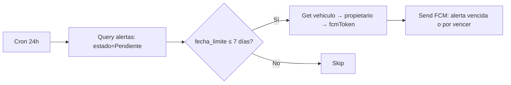
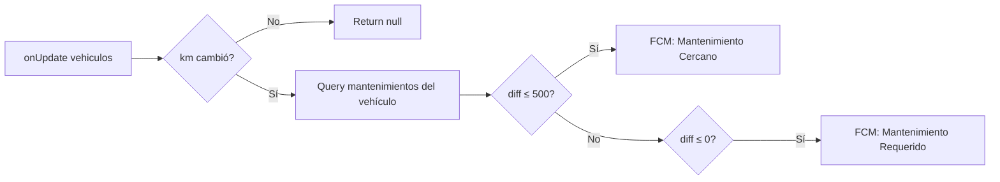
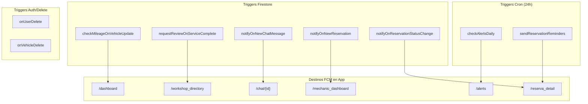

nece# Firebase Cloud Functions — AutoDoc

> **Última actualización:** 2026-07-19  
> **Archivo fuente:** `functions/index.js`  
> **Runtime:** Node.js 20  
> **Región:** us-central1 (default)

---

## Resumen

AutoDoc utiliza Cloud Functions para:
- **Notificaciones push** (FCM) automáticas por eventos en Firestore
- **Cron jobs** para alertas y recordatorios de citas
- **Cleanup** automático al eliminar usuarios o vehículos

---

## Variables de Entorno

No se requieren variables de entorno adicionales. Las funciones usan el Admin SDK con las credenciales del proyecto por defecto.

---

## Funciones

### 1. `checkAlertsDaily`

| Propiedad | Valor |
|-----------|-------|
| **Trigger** | `pubsub.schedule('every 24 hours')` — Cron |
| **Colección** | `alertas` → `vehiculos` → `usuarios` |
| **Descripción** | Revisa alertas con estado `Pendiente` cuya `fecha_limite` sea ≤ 7 días en el futuro. Envía FCM al propietario del vehículo. |

**Payload FCM:**
```json
{
  "data": {
    "type": "alerta",
    "alertaId": "<id_alerta>",
    "vehiculoId": "<id_vehiculo>"
  }
}
```

**Pantalla destino en app:** `/alerts`

**Flujo:**


---

### 2. `checkMileageOnVehicleUpdate`

| Propiedad | Valor |
|-----------|-------|
| **Trigger** | `firestore.document('vehiculos/{vehicleId}').onUpdate` |
| **Colección** | `vehiculos` → `mantenimientos` → `usuarios` |
| **Descripción** | Se activa cuando se actualiza un vehículo. Compara `kilometraje_actual` con las tareas de `mantenimientos` para notificar si un servicio está cerca (≤500 km) o ya se excedió. |

**Payload FCM:**
```json
{
  "notification": {
    "title": "Mantenimiento Cercano | Mantenimiento Requerido",
    "body": "Tu vehículo {placa} está a {diff}km de requerir {nombre}."
  }
}
```

**Pantalla destino en app:** `/dashboard` (indicadores de mantenimiento)

**Flujo:**


---

### 3. `requestReviewOnServiceComplete`

| Propiedad | Valor |
|-----------|-------|
| **Trigger** | `firestore.document('servicios/{serviceId}').onCreate` |
| **Colección** | `servicios` → `vehiculos` → `usuarios` |
| **Descripción** | Al crear un nuevo servicio en un taller (no manual), pide al propietario que deje una reseña. |

**Payload FCM:**
```json
{
  "data": {
    "type": "review",
    "tallerId": "<id_taller>",
    "serviceId": "<id_servicio>"
  }
}
```

**Pantalla destino en app:** `/workshop_directory` → detalle del taller → reseña

---

### 4. `notifyOnNewChatMessage`

| Propiedad | Valor |
|-----------|-------|
| **Trigger** | `firestore.document('conversaciones/{conversacionId}/mensajes/{mensajeId}').onCreate` |
| **Colección** | `conversaciones` → `mensajes` → `usuarios` |
| **Descripción** | Envía push al receptor cuando llega un nuevo mensaje de chat. Adapta el título/body según el tipo de mensaje (texto, cotización, reserva, vehículo, imagen). |

**Payload FCM:**
```json
{
  "data": {
    "type": "chat",
    "conversacionId": "<id_conversacion>"
  }
}
```

**Pantalla destino en app:** `/chat/{conversacionId}`

**Tipos de mensaje soportados:**
| `tipo` | Título | Body |
|--------|--------|------|
| `texto` | Nuevo mensaje de {nombre} | {contenido} |
| `cotizacion_card` | Nueva Cotización Recibida | {nombre} te ha enviado una cotización. |
| `reserva_card` | Solicitud de Cita | {nombre} te ha propuesto una fecha para cita. |
| `vehiculo_card` | Vehículo Compartido | {nombre} te ha compartido un vehículo. |
| `imagen` | Nuevo mensaje de {nombre} | 📷 Foto adjunta |

---

### 5. `notifyOnNewReservation`

| Propiedad | Valor |
|-----------|-------|
| **Trigger** | `firestore.document('reservas/{reservaId}').onCreate` |
| **Colección** | `reservas` → `usuarios` |
| **Descripción** | Notifica al mecánico cuando un propietario crea una nueva reserva. |

**Payload FCM:**
```json
{
  "data": {
    "type": "reserva",
    "reservaId": "<id_reserva>"
  }
}
```

**Pantalla destino en app:** `/mechanic_dashboard` (tab de reservas)

---

### 6. `notifyOnReservationStatusChange`

| Propiedad | Valor |
|-----------|-------|
| **Trigger** | `firestore.document('reservas/{reservaId}').onUpdate` |
| **Colección** | `reservas` → `usuarios` |
| **Descripción** | Cuando una reserva cambia de estado a `aprobada` o `rechazada`, notifica al propietario. |

**Payload FCM:**
```json
{
  "data": {
    "type": "reserva",
    "reservaId": "<id_reserva>"
  }
}
```

**Pantalla destino en app:** `/reserva_detail` (con extra `ReservaModel`)

---

### 7. `sendReservationReminders`

| Propiedad | Valor |
|-----------|-------|
| **Trigger** | `pubsub.schedule('every 24 hours')` — Cron |
| **Colección** | `reservas` → `usuarios` |
| **Descripción** | Envía recordatorios al propietario y mecánico si tienen una reserva aprobada para el día siguiente. |

**Payload FCM:**
```json
{
  "notification": {
    "title": "Recordatorio de Cita",
    "body": "Tienes una cita programada para mañana a las {hora}."
  }
}
```

**Pantalla destino en app:** `/reserva_detail`

---

### 8. `onUserDelete`

| Propiedad | Valor |
|-----------|-------|
| **Trigger** | `auth.user().onDelete` |
| **Colección** | `usuarios`, `vehiculos`, `alertas`, `servicios`, Storage `perfiles/` |
| **Descripción** | Limpieza cascada cuando se elimina una cuenta de Firebase Auth. Elimina: documento de usuario, todos sus vehículos, alertas y servicios de cada vehículo, y fotos de perfil en Storage. |

**Sin payload FCM** (el usuario fue eliminado)

---

### 9. `onVehicleDelete`

| Propiedad | Valor |
|-----------|-------|
| **Trigger** | `firestore.document('vehiculos/{vehicleId}').onDelete` |
| **Colección** | `alertas`, `mantenimientos`, `servicios`, `historial_mantenimientos`, Storage `facturas/` |
| **Descripción** | Limpieza cascada cuando se elimina un vehículo. Usa batch write para eliminar documentos relacionados y archivos de Storage. |

**Sin payload FCM**

---

## Cómo probar con emulador

```bash
# 1. Instalar Firebase CLI (si no está instalado)
npm install -g firebase-tools

# 2. Iniciar emuladores
firebase emulators:start --only functions,firestore,auth,storage

# 3. Las funciones se ejecutan automáticamente contra el emulador
#    Los triggers se activan al crear/actualizar documentos en el emulador Firestore

# 4. Para probar las funciones cron manualmente, usar el shell:
firebase functions:shell
> checkAlertsDaily()
> sendReservationReminders()
```

## Cómo desplegar

```bash
# Desplegar todas las funciones
firebase deploy --only functions

# Desplegar una función específica
firebase deploy --only functions:checkAlertsDaily

# Ver logs en producción
firebase functions:log --only checkAlertsDaily
```

---

## Diagrama general de flujo


